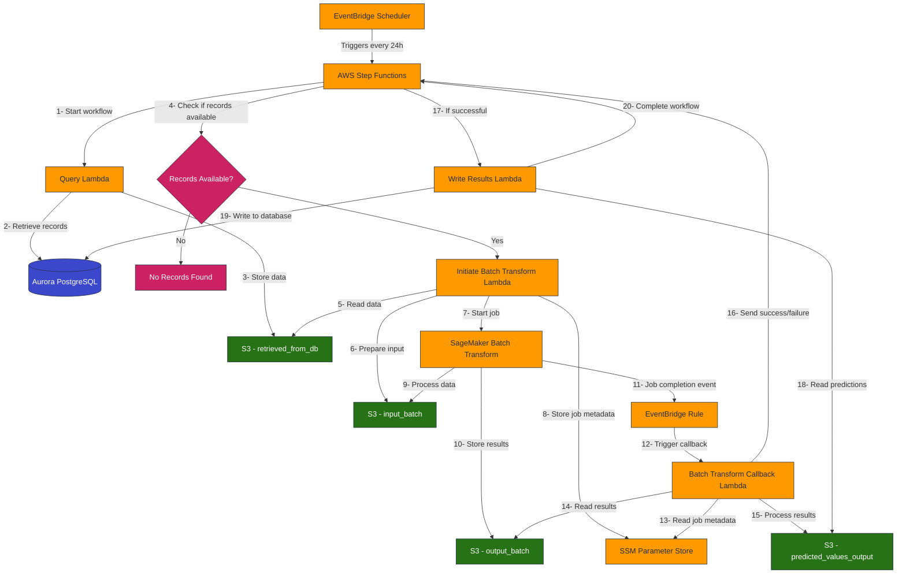
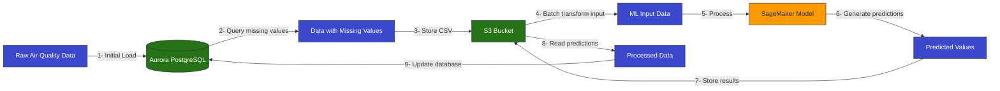
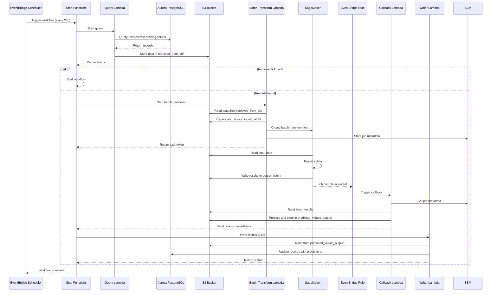

# Air Quality ML-Driven Predictive Analytics Architecture

## System Architecture Diagram



## Data Flow Diagram



## Component Interaction Sequence



## Infrastructure Stack Diagram

```mermaid
graph TD
    MainStack[Main Stack] --> NetworkStack[Network Stack]
    MainStack --> DatabaseStack[Database Stack]
    MainStack --> StorageStack[Storage Stack]
    MainStack --> SageMakerStack[SageMaker Stack]
    MainStack --> LambdaStack[Lambda Stack]
    MainStack --> StepFunctionsStack[Step Functions Stack]
    MainStack --> EventBridgeStack[EventBridge Scheduler Stack]
    
    NetworkStack --> VPC[VPC]
    NetworkStack --> SecurityGroups[Security Groups]
    
    DatabaseStack --> Aurora[Aurora PostgreSQL]
    DatabaseStack --> DBSecrets[DB Credentials Secret]
    
    StorageStack --> S3Bucket[S3 Bucket]
    
    SageMakerStack --> CanvasModel[Canvas Model]
    SageMakerStack --> BatchTransformModel[Batch Transform Model]
    
    LambdaStack --> DBInitLambda[DB Init Lambda]
    LambdaStack --> QueryLambda[Query Lambda]
    LambdaStack --> BatchTransformLambda[Batch Transform Lambda]
    LambdaStack --> CallbackLambda[Callback Lambda]
    LambdaStack --> WriterLambda[Writer Lambda]
    LambdaStack --> IAMRoles[IAM Roles]
    
    StepFunctionsStack --> StateMachine[State Machine]
    
    EventBridgeStack --> Scheduler[EventBridge Scheduler]
    
    classDef stack fill:#232F3E,stroke:#FF9900,color:white
    classDef network fill:#3B48CC,stroke:#232F3E,color:white
    classDef database fill:#3B48CC,stroke:#232F3E,color:white
    classDef storage fill:#277116,stroke:#232F3E,color:white
    classDef compute fill:#FF9900,stroke:#232F3E,color:#232F3E
    classDef orchestration fill:#CC2264,stroke:#232F3E,color:white
    classDef security fill:#7AA116,stroke:#232F3E,color:white
    
    class MainStack,NetworkStack,DatabaseStack,StorageStack,SageMakerStack,LambdaStack,StepFunctionsStack,EventBridgeStack stack
    class VPC,SecurityGroups network
    class Aurora,DBSecrets database
    class S3Bucket storage
    class CanvasModel,BatchTransformModel,DBInitLambda,QueryLambda,BatchTransformLambda,CallbackLambda,WriterLambda compute
    class StateMachine,Scheduler orchestration
    class IAMRoles security
