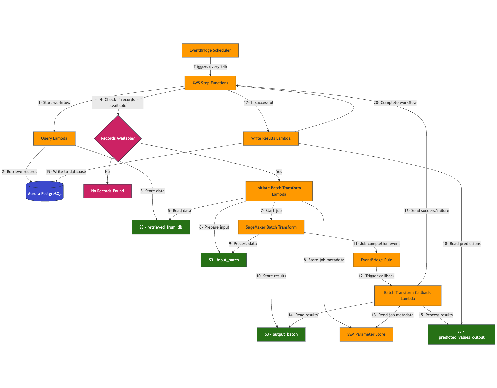

# ANYCompany Air Quality Monitoring System

## Overview
This project implements a comprehensive air quality monitoring and prediction system leveraging AWS services. The solution includes:
- Data processing orchestration that runs every 24 hour
- Machine learning-based prediction system
- Scalable database architecture for sensor data management
- Automated deployment infrastructure

> [!IMPORTANT]
> **_This solution is intended for experimental purposes and should not be used in production environments. Deployment will incur AWS service costs. Please follow the cleanup instructions when the resources are no longer needed._**

## System Architecture

The solution implements a comprehensive serverless architecture for air quality monitoring and prediction. 

### Architecture Documentation
- **[Architecture Diagram](ARCHITECTURE_DIAGRAM.md)** - Comprehensive technical documentation with interactive Mermaid diagrams
- **[Flow Diagram](FlowDiagram.png)** - Visual workflow representation showing data flow and process steps
- **[Architecture Overview](architecture_diagram.md)** - Quick reference with system overview



### Core AWS Services:
- **Amazon SageMaker AI** for machine learning operations and Canvas model endpoints
- **AWS Step Functions** for workflow orchestration and data processing pipeline
- **AWS Lambda** for serverless computing and data processing functions
- **Amazon S3** for scalable data storage with organized prefixes for different data stages
- **Amazon RDS Aurora PostgreSQL** for relational database management and sensor data storage
- **Amazon EventBridge Scheduler** for automated 24-hour interval processing
- **Amazon CloudWatch** for comprehensive monitoring and logging
- **AWS CloudFormation/CDK** for infrastructure as code deployment
- **AWS IAM** for fine-grained security and access management
- **AWS Secrets Manager** for secure database credentials management
- **Amazon VPC** for network isolation and security
- **AWS Systems Manager Parameter Store** for job metadata and configuration

### Key Architectural Features:
- **Configurable Parameter Selection**: Choose between PM 2.5, PM 10, PM 1, Temperature, Humidity, etc. for targeted predictions
- **Serverless Design**: Scales automatically based on demand, cost-effective
- **Batch Processing**: Efficient handling of large datasets through SageMaker Batch Transform
- **Fault Tolerance**: Built-in retry logic and error handling via Step Functions
- **Security First**: All data encrypted at rest and in transit, least privilege access
- **Comprehensive Monitoring**: Full observability through CloudWatch logs and metrics

## Prerequisites

### AWS Requirements
- Active AWS account with administrative privileges
- Appropriate IAM permissions for service deployment
- Selected AWS region for deployment

### Local Development Environment
- AWS CLI (configured with appropriate credentials)
- Python 3.10+
- AWS CDK for Python
- Git

### Data Requirements
The system expects air quality data in CSV format with the following fields (order flexible):

```
timestamp,value,parameter,device_id,chip_id,sensor_type,sensor_id,location_id,location,street_name,city,country,latitude,longitude,deployment_date
```

**Important Notes:**
- Column order is flexible - headers are used to identify fields
- Parameter field can contain any measurement type (PM 2.5, Temperature, Humidity, etc.)
- Timestamps must include timezone information
- GPS coordinates should be in decimal degrees format

Example Record:
```
2023-07-15 09:22:31.456 +0200,25.4,PM 2.5,24,esp8266-87654322,2,38,43,City Center,Oak Avenue,Springfield,United States,38.7823456,-92.1245678,2022-05-12 08:45:22.310 +0200
```

## Installation Guide

### Prerequisites Check

Before starting, ensure you have:
- AWS CLI configured with appropriate credentials
- Python 3.10+
- AWS CDK for Python
- Your air quality data in CSV format

### Simple Setup (Recommended)

**Step 1: Clone Repository**
```bash
# Clone the repository
git clone https://github.com/aws-samples/sample-empowering-air-quality-research-secure-machine-learning-predictive-analytics.git
cd sample-empowering-air-quality-research-secure-machine-learning-predictive-analytics
```

**Step 2: Customize Configuration (Optional)**
```bash
# Edit basic settings
vim infra/scripts/pre-deployment-config.ini

# Edit Canvas model settings  
vim infra/scripts/post-deployment-config.ini
```

**Step 3: Add Your Data**
```bash
# Place your CSV file (update filename in config if different)
cp your-data.csv infra/data/init_data.csv
```

**Step 4: Deploy**
```bash
# Setup and deploy in one command
./bin/setup.sh --use-defaults --deploy
```

**Configuration Files:**
The setup requires two configuration files that are provided with the stack:
- `infra/scripts/pre-deployment-config.ini` (basic settings)
- `infra/scripts/post-deployment-config.ini` (Canvas model)

Edit these files as needed to customize your deployment.

### Alternative Setup Options

**Interactive Setup:**
```bash
# Edit config files as needed
./bin/setup.sh                    # Shows parameters and asks for confirmation
```

**Setup Without Deploy:**
```bash
# Edit config files as needed
./bin/setup.sh --use-defaults     # Setup only, no deployment
cd infra && cdk deploy            # Deploy manually later
```

The script automatically:
- Sets up Python environment and dependencies
- Builds Lambda layer packages
- Bootstraps CDK and synthesizes templates
- Optionally deploys infrastructure (with `--deploy` flag)

**Note:** Canvas model discovery is no longer automatic. You'll need to update the Canvas model ID in your configuration file after creating your model following the blog post instructions.

## Data File Setup

### Required Data File
Before deployment, you must provide your air quality dataset:

1. **Location**: Place your CSV file at `infra/data/init_data.csv` (or your configured filename)
2. **Format**: CSV with required headers (see Prerequisites section)
3. **Size**: Large files (>100MB) may take longer to process
4. **Encoding**: Use UTF-8 encoding

### Alternative Approaches
- **Deploy First**: Deploy infrastructure, then add data file and run database initialization Lambda
- **Custom Filename**: Configure different filename in `pre-deployment-config.ini` during setup

For detailed format requirements, see `infra/data/README.md` after running setup.

## SageMaker Canvas Configuration

### Canvas Model Creation (Required)

Canvas model creation is a **separate manual step** that must be done following the blog post instructions:

1. **Deploy Infrastructure First**: Run `./bin/setup.sh --use-defaults --deploy`
2. **Create Canvas Model**:
   - Follow the detailed Canvas setup instructions in the blog post
   - This includes data preparation, model training, and deployment steps
   - The blog post provides step-by-step guidance with screenshots
3. **Update Configuration**: 
   - Edit `infra/scripts/post-deployment-config.ini` with your Canvas model ID
   - Re-deploy with `cd infra && cdk deploy`

### Configuration Management

The setup script uses configuration files instead of auto-discovery:
- The script uses a placeholder Canvas model ID initially
- You can complete the infrastructure deployment with the placeholder
- Follow the blog post to create your Canvas model
- Update the configuration file with your actual model ID and re-deploy


## Deployment

### After Setup
```bash
# If you didn't use --deploy flag during setup
cd infra
cdk deploy
```

### Database Initialization
After deployment:
1. Access AWS Console → Lambda
2. Execute the DB Initialization function
3. Your system will process the data file and be ready for predictions

## Cleanup

### AWS Resources
To prevent ongoing charges, clean up AWS resources through the console or CLI.

### Local Environment
Clean up generated files and temporary artifacts:

```bash
# Comprehensive cleanup of generated files
./bin/cleanup.sh
```

The cleanup script removes:
- Python cache files and compiled bytecode
- CDK generated files and build artifacts  
- Lambda layer packages and zip files
- Build and distribution directories
- Log files and temporary files
- IDE and editor configuration files
- AWS deployment artifacts
- Test artifacts and coverage files

**Interactive Options:**
- Configuration files (asks for confirmation)
- Virtual environment (asks for confirmation)  
- Data files (asks for confirmation)

## Troubleshooting

### Common Issues

**Setup Script Issues:**
- Configuration files must be present in `infra/scripts/` directory
- The script requires both `pre-deployment-config.ini` and `post-deployment-config.ini` files
- To modify parameters, edit the configuration files and re-run the script
- Use `./bin/setup.sh --use-defaults` for non-interactive setup

**CDK Deployment Errors:**
- Ensure AWS credentials are configured: `aws configure`
- Check you're in the correct directory: `cd infra`
- Verify CDK is bootstrapped in your region

**Data File Issues:**
- Verify file exists at `infra/data/init_data.csv`
- Check CSV format matches required headers
- Ensure UTF-8 encoding and timezone in timestamps

**Canvas Model Configuration:**
- Canvas model creation is no longer automatic
- The setup script uses configuration files with placeholder model IDs
- Update `infra/scripts/post-deployment-config.ini` with your actual Canvas model ID after creating it
- Follow the blog post to create your Canvas model after infrastructure deployment

### Getting Help
- Check CloudWatch logs for Lambda function errors
- Review CDK synthesis output for configuration issues
- Use `./bin/setup.sh --help` for setup options

## Architecture Benefits

- **Cost-Effective**: Serverless architecture scales with usage
- **Flexible**: Supports any measurement parameter, not just air quality
- **Secure**: Encrypted data, least privilege access, VPC isolation
- **Scalable**: Handles large datasets through batch processing
- **Observable**: Comprehensive monitoring and logging
- **Maintainable**: Infrastructure as code with automated deployment
