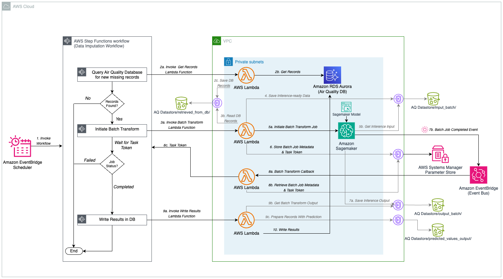

# ANYCompany Air Quality ML-Driven Predictive Analytics

## Overview
This project implements a comprehensive air quality data imputation solution leveraging AWS services. The solution includes:
- Data imputation orchestration that runs every 24 hours
- Machine learning-based prediction system
- Scalable database architecture for sensor data management
- Automated deployment infrastructure

> [!IMPORTANT]
> **_This solution is intended for experimental purposes and should not be used in production environments. Deployment will incur AWS service costs. Please follow the cleanup instructions when the resources are no longer needed._**

## System Architecture

The solution implements a comprehensive serverless architecture for air quality data imputation. 

### Architecture Documentation
- **[Architecture Overview](Architecture.png)** - Quick reference with system overview




- **[Flow Diagram](FlowDiagram.png)** - Visual workflow representation showing data flow and process steps


### Core AWS Services:
- **Amazon SageMaker AI** for machine learning operations and Canvas model endpoints
- **AWS Step Functions** for workflow orchestration and data processing pipeline
- **AWS Lambda** for serverless computing and data processing functions
- **Amazon S3** for scalable data storage with organized prefixes for different data stages
- **Amazon RDS Aurora PostgreSQL** for relational database management and sensor data storage
- **Amazon EventBridge Scheduler** for automated 24-hour interval processing
- **Amazon CloudWatch** for comprehensive monitoring and logging
- **AWS CloudFormation/CDK** for infrastructure as code deployment
- **AWS IAM** for fine-grained security and access management
- **AWS Secrets Manager** for secure database credentials management
- **Amazon VPC** for network isolation and security
- **AWS Systems Manager Parameter Store** for job metadata and configuration

### Key Architectural Features:
- **Configurable Parameter Selection**: Defaults to PM 2.5. You can also specify your desired parameter such as PM 10, PM 1, Temperature, Humidity, etc. for targeted predictions
- **Serverless Design**: Scales automatically based on demand, cost-effective
- **Batch Processing**: Efficient handling of large datasets through SageMaker Batch Transform
- **Fault Tolerance**: Built-in retry logic and error handling via Step Functions
- **Security First**: All data encrypted at rest and in transit, least privilege access
- **Comprehensive Monitoring**: Full observability through CloudWatch logs and metrics

## Prerequisites

### AWS Requirements
- Active AWS account with sufficient IAM permissions for solution deployment

### Local Development Environment
- AWS CLI (configured with appropriate credentials)
- Python 3.10+
- AWS CDK for Python
- Git

### Data Requirements
The system expects air quality dataset in CSV format with the following fields (order flexible):

```
timestamp,value,parameter,device_id,chip_id,sensor_type,sensor_id,location_id,location,street_name,city,country,latitude,longitude,deployment_date
```

**Important Notes:**
- Column order is flexible - headers are used to identify fields
- Parameter field contains air qualtiy metric (For example: PM 2.5, Temperature, Humidity, etc.)
- Timestamps must include timezone information
- GPS coordinates should be in decimal degrees format

Example Record:
```
2023-07-15 09:22:31.456 +0200,25.4,PM 2.5,24,esp8266-87654322,2,38,43,City Center,Oak Avenue,Springfield,United States,38.7823456,-92.1245678,2022-05-12 08:45:22.310 +0200
```

## Installation Guide

### Setup

**Step 1: Clone Repository**
```bash
# Clone the repository
git clone https://github.com/aws-samples/sample-empowering-air-quality-research-secure-machine-learning-predictive-analytics.git
cd sample-empowering-air-quality-research-secure-machine-learning-predictive-analytics
```

**Step 2: Add Your Data**
```bash
# Place your CSV file (update filename in config if different)
cp your-data.csv infra/data/init_data.csv
```

**Step 3: Setup Local Environment**
```bash
# Setup your python virtual environment and create initial config.ini
./bin/run.sh                    # Shows parameters and asks for confirmation
```

**Step 4: Customize Configuration (Optional)**
The setup uses a configuration template that is provided with the stack:
- `infra/scripts/config.ini.default` (template with all settings)
- `infra/scripts/config.ini` (created from template on first run)

Edit the config.ini file as needed to customize your deployment.

**Note - since this is your initial cdk deploy make sure that `create_from_canvas = false` as you do not have the SageMaker Canvas model yet**

```bash
# Edit configuration settings (created from template on first run)
vim infra/scripts/config.ini
```

The run.sh script automatically:
- Sets up Python environment and dependencies
- Builds Lambda layer packages
- Bootstraps CDK and synthesizes templates
- Optionally deploys infrastructure (with `--deploy` flag)

**Step 5: Activate Python Virtual Environment**
```bash
# Ensure you are at the root directory
source .venv/bin/activate
```

**Step 6: Initial CDK Deploy**
```bash
cd infra && cdk deploy
```

## Data File Setup

You have two options for providing your air quality dataset:

### Option 1: Local File Approach
1. **Location**: Place your CSV file at `infra/data/init_data.csv` (or your configured filename)
2. **Format**: CSV with required headers (see Prerequisites section)
3. **Size**: Suitable for smaller files (<100MB)
4. **Encoding**: Use UTF-8 encoding
5. **Deploy**: Run setup with the file in place

### Option 2: S3 Upload Approach (Recommended for Large Files)
1. **Deploy First**: Deploy infrastructure without local data file
2. **Upload to S3**: Upload your CSV file to the S3 bucket location `initial_dataset/`
3. **Initialize Database**: Run the database initialization Lambda function
4. **Processing**: Lambda will process the file from S3 and populate the database

### Alternative Approaches
- **Deploy First**: Deploy infrastructure, then add data file and run database initialization Lambda
- **Custom Filename**: Configure different filename in `config.ini` during setup

For detailed format requirements, see `infra/data/README.md` after running setup.

## Model Setup for Batch Inference

After deploying your infrastructure, you need to create a SageMaker model for batch inference. You have two options:

### Option 1: Canvas Model (Recommended for Beginners)

Follow the blog post instructions to create a Canvas model, then create a SageMaker model from it:

1. **Create Canvas Model**: Follow the detailed Canvas setup instructions in the blog post
2. **Create SageMaker Model from Canvas**: Use the CLI commands below
3. **Update Configuration**: Add the model ID to your config file

### Option 2: Model Registry (Recommended for MLOps)

If you have models in SageMaker Model Registry, create a SageMaker model from the latest approved version:

1. **List Available Model Package Groups**:
   ```bash
   aws sagemaker list-model-package-groups --query 'ModelPackageGroupSummaryList[*].ModelPackageGroupName'
   ```

2. **Find Latest Approved Model Package**:
   ```bash
   # Replace 'your-model-package-group-name' with your actual group name
   aws sagemaker list-model-packages \
     --model-package-group-name your-model-package-group-name \
     --model-package-type Versioned \
     --model-approval-status Approved \
     --sort-by CreationTime \
     --sort-order Descending \
     --max-results 1 \
     --query 'ModelPackageSummaryList[0].ModelPackageArn'
   ```

3. **Create SageMaker Model from Model Package**:
   ```bash
   # Get your SageMaker execution role ARN (from CDK outputs)
   SAGEMAKER_ROLE_ARN=$(aws cloudformation describe-stacks \
     --stack-name YourStackName-SageMakerStack \
     --query 'Stacks[0].Outputs[?OutputKey==`SageMakerExecutionRoleArn`].OutputValue' \
     --output text)

   # Create the model (replace MODEL_PACKAGE_ARN with the ARN from step 2)
   aws sagemaker create-model \
     --model-name "air-quality-batch-model-$(date +%Y%m%d)" \
     --containers ModelPackageName=MODEL_PACKAGE_ARN \
     --execution-role-arn $SAGEMAKER_ROLE_ARN
   ```

4. **Verify Model Creation**:
   ```bash
   # List your models to confirm creation
   aws sagemaker list-models --name-contains "air-quality-batch" --query 'Models[*].[ModelName,CreationTime]' --output table
   ```

### Update Configuration

After creating your model using either option:

1. **Get Your Model Name**:
   ```bash
   # For Canvas models, the name is typically the Canvas model name
   # For Registry models, use the name you specified in create-model command
   ```

2. **Update Configuration File**:
   ```bash
   # Edit the config file
   vim infra/scripts/config.ini
   
   # Update the model ID:
   aq_canvas_model_id = your-actual-model-name
   ```

3. **Re-deploy with Updated Configuration**:
   ```bash
   cd infra && cdk deploy
   ```

### Model Management Tips

- **Model Names**: Use descriptive names with dates (e.g., `air-quality-model-20241218`)
- **Model Lifecycle**: Models are free to keep, but you can delete old ones to keep things organized
- **Model Updates**: When you have a new model version, create a new SageMaker model and update the config
- **Testing**: You can test your model using the AWS Console or CLI before updating the configuration


## Deployment

### After Setup
```bash
# If you didn't use --deploy flag during setup
cd infra
cdk deploy
```

### Database Initialization
After deployment:
1. Access AWS Console → Lambda
2. Execute the DB Initialization function
3. Your system will process the data file and be ready for predictions

## Cleanup

### AWS Resources
To prevent ongoing charges, clean up AWS resources through the console or CLI.

### Local Environment
Clean up generated files and temporary artifacts:

```bash
# Comprehensive cleanup of generated files
./bin/cleanup.sh
```

The cleanup script removes:
- Python cache files and compiled bytecode
- CDK generated files and build artifacts  
- Lambda layer packages and zip files
- Build and distribution directories
- Log files and temporary files
- IDE and editor configuration files
- AWS deployment artifacts
- Test artifacts and coverage files

**Interactive Options:**
- Configuration files (asks for confirmation)
- Virtual environment (asks for confirmation)  
- Data files (asks for confirmation)

## Troubleshooting

### Common Issues

**Setup Script Issues:**
- Configuration template must be present in `infra/scripts/` directory
- The script requires `config.ini.default` file and creates `config.ini` from it
- To modify parameters, edit the `config.ini` file and re-run the script
- Use `./bin/run.sh --use-defaults` for non-interactive setup

**CDK Deployment Errors:**
- Ensure AWS credentials are configured: `aws configure`
- Check you're in the correct directory: `cd infra`
- Verify CDK is bootstrapped in your region

**Data File Issues:**
- Verify file exists at `infra/data/init_data.csv`
- Check CSV format matches required headers
- Ensure UTF-8 encoding and timezone in timestamps

**Canvas Model Configuration:**
- Canvas model creation is no longer automatic
- The setup script creates `config.ini` from template with placeholder model ID
- Update `infra/scripts/config.ini` with your actual Canvas model ID after creating it
- Follow the blog post to create your Canvas model after infrastructure deployment

### Getting Help
- Check CloudWatch logs for Lambda function errors
- Review CDK synthesis output for configuration issues
- Use `./bin/run.sh --help` for setup options

## Architecture Benefits

- **Cost-Effective**: Serverless architecture scales with usage
- **Flexible**: Supports any measurement parameter, not just air quality
- **Secure**: Encrypted data, least privilege access, VPC isolation
- **Scalable**: Handles large datasets through batch processing
- **Observable**: Comprehensive monitoring and logging
- **Maintainable**: Infrastructure as code with automated deployment
