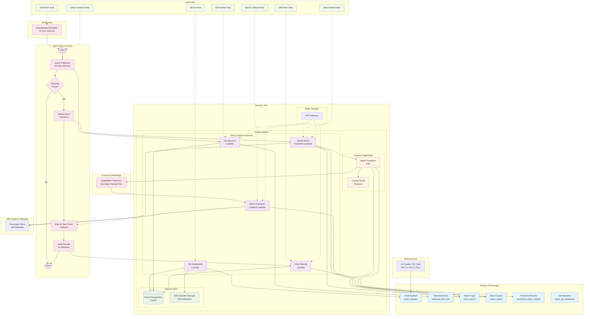

# Air Quality Monitoring System - Architecture Diagram

## System Architecture Overview

## Detailed Component Description

### 1. Data Ingestion Layer
- **CSV Data Sources**: Air quality sensor data containing PM 2.5, PM 10, and PM 1 measurements
- **S3 Initial Dataset**: Raw sensor data uploaded to `initial_dataset/` prefix
- **Configuration**: Users can select which parameter (PM 2.5, PM 10, or PM 1) to focus on for predictions

### 2. Scheduling & Orchestration
- **EventBridge Scheduler**: Triggers the workflow every 24 hours
- **EventBridge Rules**: Monitor SageMaker batch transform job state changes
- **Step Functions State Machine**: Orchestrates the entire data processing pipeline
  - Queries database for new records
  - Initiates batch transform jobs
  - Waits for task token callback (not direct completion)
  - Writes results back to database

### 3. Compute Layer (AWS Lambda)
- **DB Initialization Lambda**: Sets up database schema and loads initial data
- **Get Records Lambda**: Queries database for unprocessed records matching selected parameter
- **Initiate Batch Transform Lambda**: Creates SageMaker batch transform jobs and stores task tokens
- **Batch Transform Callback Lambda**: Triggered by EventBridge when jobs complete, sends task tokens back to Step Functions
- **Write Results Lambda**: Stores prediction results back to database

### 4. Machine Learning Layer
- **SageMaker Canvas Model Endpoint**: Pre-trained model for air quality predictions
- **Batch Transform Jobs**: Processes large datasets efficiently
- **Model Artifacts**: Stored in S3 for version control

### 5. Data Storage Layer
- **Amazon S3**: Multiple prefixes for different data stages
  - `initial_dataset/`: Raw input data
  - `retrieved_from_db/`: Data extracted from database
  - `input_batch/`: Prepared for ML inference
  - `output_batch/`: ML prediction results
  - `predicted_values_output/`: Final processed results
  - `batch_job_metadata/`: Job tracking information
- **Aurora PostgreSQL**: Stores sensor data and prediction results
- **AWS Secrets Manager**: Securely manages database credentials

### 6. Security & Access Control
- **IAM Roles**: Least privilege access for each component
  - DB Init Role: Database setup permissions
  - DB Reader Role: Read-only database access
  - DB Writer Role: Read-write database access
  - Batch Initiate Role: SageMaker job creation and S3 input permissions
  - Batch Callback Role: S3 output processing and Step Functions callback permissions
  - Step Functions Role: Orchestration permissions
  - Scheduler Role: EventBridge permissions

### 7. Network Architecture
- **VPC**: Isolated network environment
- **Public Subnets**: NAT Gateway for outbound internet access
- **Private Subnets**: All compute and database resources
- **Security Groups**: Fine-grained network access control

### 8. Monitoring & Metadata
- **CloudWatch Logs**: Centralized logging for all components
- **CloudWatch Metrics**: Performance and health monitoring
- **Parameter Store**: Stores batch job metadata and configuration

## Data Flow Process

1. **Initialization**: CSV data is uploaded to S3, database is initialized with schema and initial data
2. **Scheduled Trigger**: EventBridge Scheduler triggers Step Functions every 24 hours
3. **Data Query**: Lambda function queries database for new records matching the configured parameter (PM 2.5, PM 10, or PM 1)
4. **Conditional Processing**: If records are found, proceed with ML inference; otherwise, end workflow
5. **Batch Transform Initiation**: InitiateBatchTransform Lambda creates SageMaker batch job and stores task token
6. **Step Functions Wait**: Step Functions enters WAIT_FOR_TASK_TOKEN state
7. **EventBridge Monitoring**: EventBridge monitors SageMaker job completion events
8. **Callback Trigger**: When job completes, EventBridge triggers BatchTransformCallback Lambda
9. **Task Token Callback**: Callback Lambda sends success/failure back to Step Functions using stored task token
10. **Result Storage**: Step Functions resumes and writes predictions to database with `predicted_label = true`
11. **Completion**: Workflow ends, ready for next scheduled execution

## Key Features

- **Configurable Parameter Selection**: Users can choose which air quality parameter to predict
- **Scalable Architecture**: Handles large datasets through batch processing
- **Fault Tolerant**: Step Functions provide retry logic and error handling
- **Secure**: All data encrypted at rest and in transit, least privilege access
- **Cost Optimized**: Serverless architecture scales to zero when not in use
- **Monitored**: Comprehensive logging and metrics for operational visibility

## Timeout Configuration

### Step Functions
- **Overall State Machine**: 2 hours maximum execution time
- **Individual Steps**: 1 hour timeout each (Query, Batch Transform, Write Results)

### Lambda Functions
- **Initiate Batch Transform Lambda**: 15 minutes (complex data processing)
- **Other Lambda Functions**: 2 minutes (standard operations)

## Error Handling

The system includes comprehensive error handling:
- **Timeout States**: Specific failure states for timeout scenarios
- **Error Catching**: All Lambda tasks have explicit error handling
- **Failure Callbacks**: Proper Step Functions failure notifications
- **Status Code Handling**: HTTP 400+ errors transition to failed states
